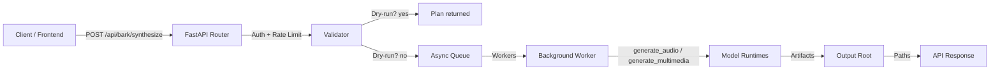
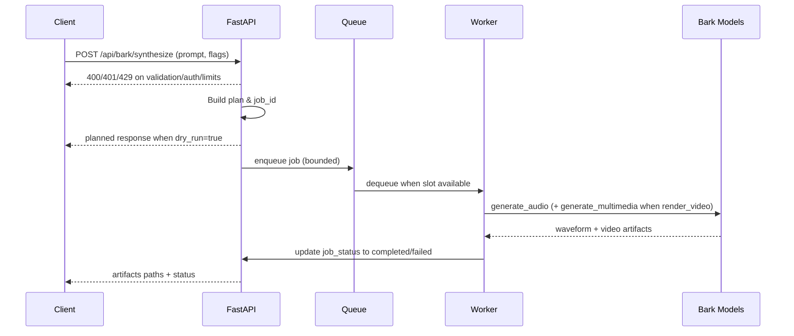

# Bark System Reference Document (SRD)

**Version:** 0.1.0 (aligned with `bark.server` FastAPI app)

## Scope and Goals
- Capture the end-to-end architecture for Bark's inference stack, public APIs, deployment options, and operations.
- Keep docs coupled to code by anchoring details (config names, API schemas, behaviors) to current module implementations.
- Provide diagrams and runbooks so operators can deploy, scale, and troubleshoot consistently.

## System Architecture

### Component Overview
- **Client surfaces:**
  - REST API exposed by `bark.server` (`/api/health`, `/api/capabilities`, `/api/bark/synthesize`).
  - Optional Three.js/WebRTC frontend under `frontend/` that targets the REST API.
  - Python SDK (`generate_audio`, `generate_multimedia`) for direct library use.
- **Application service:** FastAPI app (`bark.server`) with dependency-injected `ServiceConfig`, request auth, rate limiting, bounded async job queue, and background workers.
- **Generation engines:**
  - Audio: `bark.api.generate_audio` producing waveform arrays at `bark.generation.SAMPLE_RATE`.
  - Multimedia: `bark.api.generate_multimedia` returning muxed MP4, captions, and metadata using `VideoGenerationConfig`.
- **Storage:** Outputs are written to the configured `output_root` (default `outputs/`) with sanitized job-based prefixes; video and audio artifacts share the same root.
- **Observability hooks:** Optional `log_hook` and `metrics_hook` callbacks are invoked around queue lifecycle events.

### Data Flow

### Sequence for Synthesis

### Models
- Bark uses pretrained transformer-based text-to-audio checkpoints accessed through `generate_audio` and `generate_multimedia`.
- `BARK_MODELS_AVAILABLE` (truthy values: `1`, `true`, `yes`) toggles whether the server allows full synthesis; otherwise `/api/bark/synthesize` requires `dry_run=true`.
- Audio sample rate is defined by `SAMPLE_RATE` (see `bark/generation.py`); WAV output is produced via `scipy.io.wavfile.write` with NaN-safe handling.
- Video rendering uses `VideoGenerationConfig` defaults (4K/30fps, H.264, AAC) unless overridden in the request payload.

## API Contracts

### Authentication & Rate Limiting
- Optional API key header: `X-API-Key` must match `ServiceConfig.api_key` when set.
- Per-client rate limit: `BARK_RATE_LIMIT_PER_MIN` requests per minute (default 30), keyed by client IP.

### Endpoints
| Route | Method | Purpose | Request Schema | Response |
| --- | --- | --- | --- | --- |
| `/api/health` | GET | Liveness check; returns version and UTC timestamp. | None | `{ status, time, version }` |
| `/api/capabilities` | GET | Advertises supported modalities and presets. | None | `{ modalities, video_presets, audio_bitrates, codecs, notes }` |
| `/api/bark/synthesize` | POST | Plan or execute Bark synthesis. Applies auth, rate limit, and queue admission. | `SynthesisRequest` | `SynthesisResponse` with `status`, `plan`, `artifacts` |
| `/api/bark/jobs/{job_id}` | GET | Retrieve latest job metadata after submission (planned, queued, running, completed, failed). | `job_id` path param | `JobStatusResponse` mirrors `SynthesisResponse` fields with optional `error` |

#### `SynthesisRequest`
- `prompt` (str, required): text to synthesize.
- `caption_text` (str, optional): override auto-caption text when rendering video.
- `modalities` (list[str], default `["audio"]`): requested outputs.
- `render_video` (bool, default `false`): trigger MP4 creation via `generate_multimedia`.
- `dry_run` (bool, default `true` when models unavailable): return plan without generation.
- `output_path` (path, optional): directory or file prefix under `output_root`.
- `text_temp`, `waveform_temp` (float 0.0–1.5): sampling temperatures.
- `control_events` (list[ControlEvent], optional) and `routing_priorities` (dict[str, float], optional) for modality routing.
- `video` (VideoPayload, optional): overrides for resolution, fps, bitrate, and codecs.

#### `SynthesisResponse`
- `job_id` (str): server-generated identifier.
- `status` (str): one of `planned`, `queued`, `running`, `completed`, `failed`.
- `plan` (object): echo of input-driven planning metadata.
- `artifacts` (dict[str, str]): absolute or relative paths to generated WAV/MP4/captions (empty on dry-run or failure).
- Dry-run submissions are recorded in memory so clients can still call `/api/bark/jobs/{job_id}` for plan confirmation.

#### `JobStatusResponse`
- `job_id`, `status`, `plan`, `artifacts` as above; `error` contains a human-readable string when a job fails.
- Returns `404` when an unknown `job_id` is requested.

#### Error Conditions
- `400` on validation (empty prompt, unsafe output path) or malformed input.
- `401` when API key is required and missing/invalid.
- `429` when rate limit is exceeded or queue is full.
- `500/503` when model execution fails or models are unavailable.

## Configuration Reference

| Variable | Default | Description |
| --- | --- | --- |
| `BARK_MODELS_AVAILABLE` | `""` (falsey) | Enables full synthesis when truthy; otherwise only dry-run is allowed. |
| `BARK_MAX_QUEUE_SIZE` | `8` | Maximum jobs awaiting workers. |
| `BARK_MAX_CONCURRENCY` | `2` | Concurrent worker slots; also governs semaphore used by workers. |
| `BARK_RATE_LIMIT_PER_MIN` | `30` | Per-client request limit per minute. |
| `BARK_OUTPUT_ROOT` | `outputs` | Root directory for artifacts; sanitized job IDs are appended. |
| `BARK_API_KEY` | unset | Optional shared secret checked against `X-API-Key`. |

Additional operational knobs: adjust UVicorn workers/threads at process level; supply `log_hook` and `metrics_hook` when embedding `create_app()`.

## Deployment Topologies

### Local Development
- Install dependencies (`pip install .`), then run `python -m bark.server` for a single-process server with default queue/concurrency.
- The frontend `frontend/index.html` can call the API when served via `file://` or a static server; ensure CORS policy fits your environment.

### GPU-Capable Single Node
- Enable models (`BARK_MODELS_AVAILABLE=true`) and ensure model weights are present or downloaded on first run.
- Launch with UVicorn (example): `uvicorn bark.server:app --host 0.0.0.0 --port 8000 --workers 1 --timeout-keep-alive 120`.
- Mount persistent storage for `BARK_OUTPUT_ROOT` to retain artifacts.

### Scaled API Tier
- Run multiple UVicorn/Gunicorn workers behind a load balancer (sticky IPs help rate limiting fairness).
- Externalize artifacts to shared storage (object store or network volume) by pointing `BARK_OUTPUT_ROOT` to a mounted path.
- Use an API gateway to enforce global rate limits and TLS termination; propagate `X-API-Key` or a service-issued token.

### Fault Tolerance & Resilience
- Queue backpressure: tune `BARK_MAX_QUEUE_SIZE` and return `429` when saturated; clients should implement retries with jitter.
- Worker isolation: prefer multiple processes over threads for model workloads; supervise with systemd/k8s and restart on crashes.
- Health monitoring: scrape `/api/health` and alert when status != `ok` or latency breaches SLOs.
- Graceful shutdown: ensure UVicorn receives SIGTERM; background tasks are cancelled via the lifespan context to avoid stuck jobs.

## Operational Runbooks

### Bring-Up
1. Set environment as needed (API key, concurrency, output root, model availability).
2. Start server: `python -m bark.server` or `uvicorn bark.server:app --host 0.0.0.0 --port 8000`.
3. Verify health: `curl http://localhost:8000/api/health`.
4. Inspect capabilities: `curl http://localhost:8000/api/capabilities`.
5. Issue a dry-run to confirm request schema: `curl -X POST http://localhost:8000/api/bark/synthesize -H "Content-Type: application/json" -d '{"prompt":"hello","dry_run":true}'`.

### Production Checks
- **Authentication:** send `X-API-Key` header when configured; observe `401` otherwise.
- **Rate limits:** load-test to confirm `429` responses after `BARK_RATE_LIMIT_PER_MIN` requests per minute per client.
- **Queue saturation:** monitor rejection rate; increase `BARK_MAX_QUEUE_SIZE` or add replicas when saturation persists.
- **Artifacts:** validate that WAV/MP4 paths resolve under `BARK_OUTPUT_ROOT`; ensure filesystem permissions and free space.

### Incident Response
- **Model failures (500/503):** confirm `BARK_MODELS_AVAILABLE` is true; check model weights and GPU availability.
- **Stuck jobs:** restart process; lifespan teardown cancels workers. Consider draining queue by restarting during low traffic.
- **Logging/metrics gaps:** inject `log_hook`/`metrics_hook` when embedding or wrap UVicorn with middleware to surface traces.

### Updating Documentation
- Increment the SRD `Version` when API contracts or configuration change.
- Update diagrams and tables alongside code changes; keep README pointers current.
- Capture new env vars, request fields, or behaviors in the configuration and API sections.
